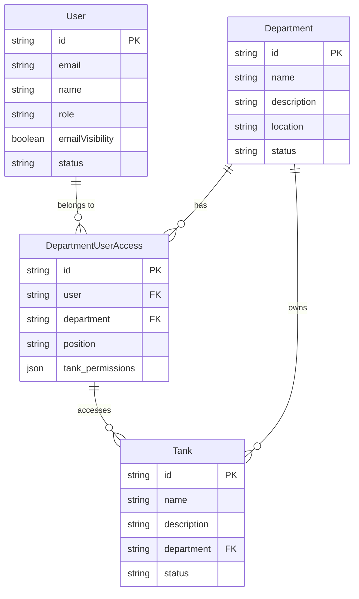

# แผนพัฒนาปรับปรุงความสัมพันธ์ระหว่าง User, Department และ Tank

## แผนภาพความสัมพันธ์



## โครงสร้างข้อมูล

### หลักการ
- ความสัมพันธ์ระหว่าง user กับ department ควรเก็บไว้ที่ `department_user_access` เท่านั้น
- ไม่ควรเก็บ field `department` ใน user record
- ไม่ควรเก็บ field `member` ใน department record
- Tank จะผูกกับ department โดยตรงผ่าน field `department` ใน tank record
- User จะเข้าถึง tank ผ่าน department_user_access ที่มี tank_permissions

### ความสัมพันธ์ของ Tank
1. Tank - Department
   - Tank อยู่ได้ใน department เดียวเท่านั้น (One-to-One)
   - Department มีได้หลาย tanks (One-to-Many)
   - เก็บ department ID ใน tank record

2. Tank - User Access
   - User เข้าถึง tank ผ่าน department_user_access
   - tank_permissions ใน department_user_access กำหนดสิทธิ์การเข้าถึง tank
   - สิทธิ์แบ่งเป็นระดับต่างๆ: view, edit, admin

### ขั้นตอนการปรับปรุง

1. Migration Script
   - ดึงข้อมูล department จาก user records ทั้งหมด
   - สร้าง records ใหม่ใน department_user_access
   - ลบ field department ออกจาก user records
   - ตรวจสอบความถูกต้องของ tank permissions

2. แก้ไข Register Endpoint
   - ไม่เซ็ต department ใน user record
   - สร้าง record ใน department_user_access แทน
   - ปรับปรุง response format
   - เพิ่ม default tank permissions ตาม role

3. แก้ไข Get User Endpoint
   - join กับ department_user_access เพื่อดึงข้อมูล department
   - join กับ tanks เพื่อดึงข้อมูล tanks ที่มีสิทธิ์เข้าถึง
   - ปรับปรุง response format

## Flow การทำงานใหม่

1. User Registration
   ```
   POST /auth/register
   {
     "email": "user@example.com",
     "password": "password123",
     "name": "User Name",
     "role": "operator",
     "department": "Department Name"  // Optional
   }
   ```
   
   ขั้นตอน:
   1. สร้าง user record (ไม่มี department field)
   2. ถ้ามีการระบุ department:
      - ค้นหา department ID จากชื่อ
      - สร้าง department_user_access record พร้อม default tank_permissions

2. Get User Info
   ```
   GET /users/:id
   ```
   
   ขั้นตอน:
   1. ดึงข้อมูล user
   2. Join กับ department_user_access
   3. Join กับ departments เพื่อดึงชื่อ department
   4. Join กับ tanks เพื่อดึงข้อมูล tanks ที่มีสิทธิ์เข้าถึง
   
   Response:
   ```json
   {
     "id": "user_id",
     "email": "user@example.com",
     "name": "User Name",
     "role": "operator",
     "departments": [
       {
         "id": "dept_id",
         "name": "Department Name",
         "position": "operator",
         "tank_permissions": {
           "tank_id_1": {
             "view": true,
             "edit": false,
             "admin": false
           }
         },
         "accessible_tanks": [
           {
             "id": "tank_id_1",
             "name": "Tank 1",
             "permissions": ["view"]
           }
         ]
       }
     ]
   }
   ```

## การทดสอบ

1. Migration Test
   - ตรวจสอบว่าข้อมูลถูกย้ายครบถ้วน
   - ตรวจสอบว่าไม่มี field department ใน user records
   - ตรวจสอบว่า tank permissions ถูกต้อง

2. Registration Test
   - ทดสอบ register โดยไม่ระบุ department
   - ทดสอบ register โดยระบุ department
   - ทดสอบ register โดยระบุ department ที่ไม่มีอยู่
   - ตรวจสอบ default tank permissions

3. Get User Test
   - ทดสอบดึงข้อมูล user ที่ไม่มี department
   - ทดสอบดึงข้อมูล user ที่มี department เดียว
   - ทดสอบดึงข้อมูล user ที่มีหลาย departments
   - ตรวจสอบการแสดงข้อมูล tanks ที่มีสิทธิ์เข้าถึง

4. Tank Access Test
   - ทดสอบการเข้าถึง tank โดย user ที่มีสิทธิ์
   - ทดสอบการเข้าถึง tank โดย user ที่ไม่มีสิทธิ์
   - ทดสอบการแก้ไข tank โดย user ที่มีสิทธิ์ edit
   - ทดสอบการแก้ไข tank โดย user ที่มีสิทธิ์ view อย่างเดียว 